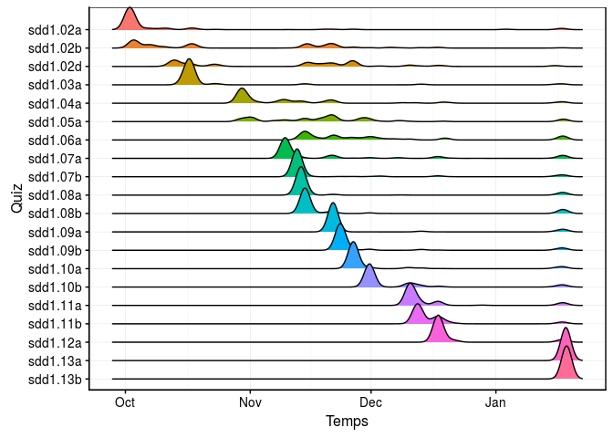

Outils de détection des difficultés des étudiants dans l'utilisation de quiz interactifs (package leanr)
================

Auteurs
=======

-   [Guyliann Engels](https://github.com/GuyliannEngels)
-   [Philippe Grosjean](https://github.com/phgrosjean)

Résumé
======

Cette application shiny a pour objectif de proposer un outil de détection des difficultés des étudiants.

Les étudiants réalisent des quiz interactifs via le package `learnr`. L'ensemble des questions composant les quiz renvoie des informations dans une base de données que nous souhaitons analyser via une application shiny.

Nous observons deux types de graphique de densité avec un pic concentré pour les quiz tels sdd1.02 a, sdd1.03a ou bien des graphes de densité plus étendue comme sdd1.05a ou encore sdd1.06 a. Que cachent ces deux types de graphiques de densités ? Les étudiants ont-ils éprouvé une difficulté particulière ?

La shiny App a pour objectif de répondre à cette question via divers graphiques.
